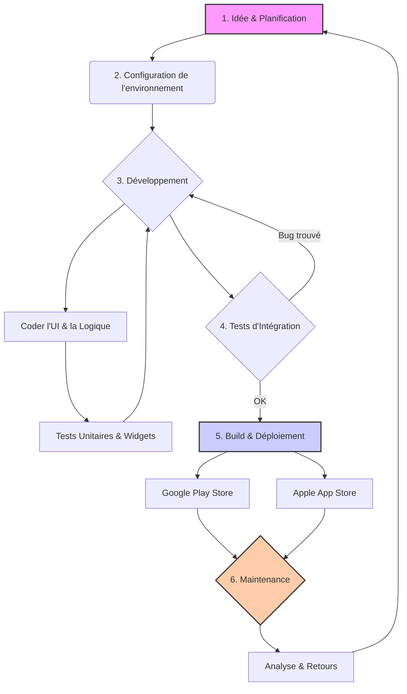

# Enchainements de d"veloppement 

Voici un aperçu complet des enchaînements de développement d'une application mobile avec **Flutter**, illustré par des exemples pratiques et un diagramme de flux pour une meilleure compréhension.

### Les Grandes Étapes du Développement d'une Application Flutter

Le développement d'une application Flutter suit un processus itératif et structuré, allant de l'idée initiale au déploiement et à la maintenance. Voici les étapes clés :

-----

## 1\. Conception et Planification (Phase Idéation) 💡

Avant d'écrire la moindre ligne de code, cette phase est cruciale pour définir les fondations du projet.

  * **Définition de l'idée** : Quelle est la proposition de valeur de l'application ? Quel problème résout-elle ?
  * **Analyse du marché** : Qui sont les concurrents ? Quelles sont les fonctionnalités attendues par les utilisateurs cibles ?
  * **Conception UX/UI** :
      * **Wireframes** : Schémas de bas niveau montrant la structure des écrans et la navigation.
      * **Maquettes (Mockups)** : Représentations visuelles haute-fidélité de l'interface utilisateur.
      * **Prototype** : Maquette interactive pour tester le flux de l'utilisateur.
  * **Spécifications techniques** : Quelles fonctionnalités inclure (authentification, base de données, notifications, etc.) ? Quelle architecture choisir (BLoC, Provider, Riverpod, etc.) ?

**Exemple concret** :

  * **Idée** : Une application de liste de tâches simple.
  * **UX/UI** : Création de maquettes sur Figma montrant l'écran principal avec la liste des tâches, un bouton "+" pour en ajouter une nouvelle, et un écran de détail pour chaque tâche.
  * **Architecture** : Choix de **Provider** pour la gestion de l'état, car il est simple et bien intégré à Flutter.

-----

## 2\. Configuration de l'Environnement et Initialisation du Projet 🛠️

C'est ici que le développement technique commence.

  * **Installation de Flutter** : S'assurer que le SDK Flutter et ses dépendances (comme Android Studio et Xcode) sont correctement installés.
  * **Création du projet** : Utiliser la commande `flutter create nom_du_projet` pour générer la structure de base du projet.
  * **Ajout des dépendances** : Éditer le fichier `pubspec.yaml` pour inclure les packages nécessaires (par exemple, `provider` pour la gestion d'état, `http` pour les requêtes réseau, `firebase_core` pour l'intégration de Firebase).

**Exemple concret** :

1.  **Créer le projet** :
    ```bash
    flutter create todo_app
    ```
2.  **Ajouter les dépendances dans `pubspec.yaml`** :
    ```yaml
    dependencies:
      flutter:
        sdk: flutter
      provider: ^6.0.0
      shared_preferences: ^2.0.15
    ```
3.  **Installer les packages** :
    ```bash
    flutter pub get
    ```

-----

## 3\. Développement des Fonctionnalités (Phase de Codage) 💻

Cette phase est le cœur du projet. On développe l'application écran par écran, fonctionnalité par fonctionnalité. C'est un cycle : coder, tester, répéter.

  * **Structure du projet** : Organiser les fichiers et dossiers de manière logique (par exemple, un dossier par fonctionnalité : `lib/src/features/tasks`).
  * **Développement de l'UI** : Traduire les maquettes en widgets Flutter. On construit l'interface avec des widgets comme `Scaffold`, `AppBar`, `ListView`, `Text`, `Icon`, etc.
  * **Implémentation de la logique métier** : Coder la logique qui gère les données et les interactions.
      * **Gestion de l'état** : Utiliser un gestionnaire d'état (comme Provider) pour séparer l'UI de la logique et permettre à l'interface de se mettre à jour lorsque les données changent.
      * **Interaction avec les services** : Gérer les appels API, la persistance des données locales (avec `shared_preferences` ou une base de données comme SQLite).

**Exemple concret (Application de liste de tâches)** :

1.  **Créer le modèle de données** (`task.dart`) :
    ```dart
    class Task {
      String title;
      bool isDone;
      Task({required this.title, this.isDone = false});
    }
    ```
2.  **Créer le gestionnaire d'état** (`task_provider.dart`) avec Provider :
    ```dart
    class TaskProvider with ChangeNotifier {
      List<Task> _tasks = [];
      List<Task> get tasks => _tasks;

      void addTask(String title) {
        _tasks.add(Task(title: title));
        notifyListeners(); // Notifie les widgets qui écoutent
      }
    }
    ```
3.  **Construire l'UI** (`task_list_screen.dart`) : Utiliser un `Consumer<TaskProvider>` pour afficher la liste des tâches et un `FloatingActionButton` pour en ajouter de nouvelles.

-----

## 4\. Test et Débogage 🐞

Les tests sont essentiels pour garantir la qualité et la stabilité de l'application.

  * **Tests unitaires** : Vérifier le bon fonctionnement des fonctions et des classes de manière isolée (par exemple, tester la méthode `addTask` du `TaskProvider`).
  * **Tests de widgets** : Tester des widgets individuels pour s'assurer qu'ils s'affichent et réagissent correctement.
  * **Tests d'intégration** : Tester des flux complets de l'application (par exemple, simuler l'ajout d'une tâche et vérifier qu'elle apparaît dans la liste).
  * **Débogage** : Utiliser les **Flutter DevTools** pour inspecter l'arborescence des widgets, analyser les performances et déboguer le code.

**Exemple concret** :

  * **Test unitaire pour `TaskProvider`** :
    ```dart
    test('a new task should be added to the list', () {
      final taskProvider = TaskProvider();
      taskProvider.addTask('Test task');
      expect(taskProvider.tasks.length, 1);
      expect(taskProvider.tasks.first.title, 'Test task');
    });
    ```

-----

## 5\. Construction et Déploiement 🚀

Une fois l'application développée et testée, il est temps de la mettre entre les mains des utilisateurs.

  * **Préparation pour la publication** :
      * Mettre à jour l'icône de l'application.
      * Configurer l'écran de démarrage (Splash Screen).
      * Signer l'application (essentiel pour Android et iOS).
  * **Génération des builds** :
      * **Android** : `flutter build apk --release` ou `flutter build appbundle --release`.
      * **iOS** : `flutter build ipa --release`.
  * **Publication sur les stores** :
      * **Google Play Store** : Créer une fiche d'application, téléverser l'App Bundle, remplir les informations requises (descriptions, captures d'écran) et soumettre pour examen.
      * **Apple App Store** : Utiliser Xcode et TestFlight pour téléverser le build, créer une fiche sur App Store Connect et soumettre.

-----

## 6\. Maintenance et Mises à Jour 🔄

Le travail ne s'arrête pas après le lancement.

  * **Surveillance** : Utiliser des outils (comme Firebase Crashlytics) pour surveiller les plantages et les erreurs.
  * **Collecte des retours** : Analyser les commentaires des utilisateurs sur les stores.
  * **Itérations** : Planifier et développer de nouvelles fonctionnalités ou corriger des bugs, puis redéployer une nouvelle version en suivant les mêmes étapes.

### Diagramme de Flux du Développement Flutter (Flow)

Voici une représentation visuelle du processus :



Ce flux montre bien la nature cyclique du développement, où les phases de codage et de test sont étroitement liées, et où la maintenance ramène à une nouvelle phase de planification pour les versions futures.
