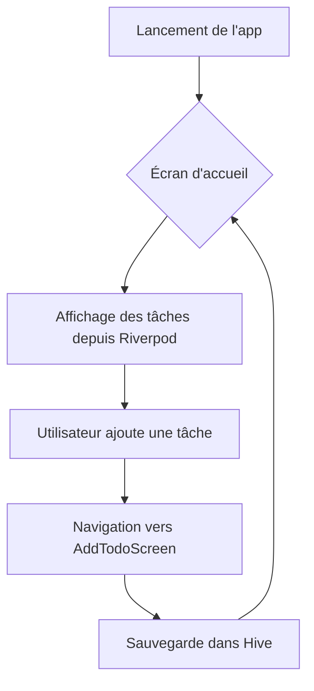

### Enchaînements de Développement Flutter : Flux Complet avec Exemples Concrets

Voici un workflow typique pour développer une application Flutter, illustré avec un exemple concret d'**application de liste de tâches** (Todo App) :

---

#### **1. Configuration Initiale**
```bash
# Création du projet
flutter create todo_app
cd todo_app

# Structure de base :
lib/
├── main.dart
├── models/
├── services/
├── screens/
├── widgets/
└── utils/
```

---

#### **2. Modèles de Données (Models)**
**Fichier : `lib/models/todo.dart`**
```dart
class Todo {
  final String id;
  String title;
  bool completed;

  Todo({
    required this.id,
    required this.title,
    this.completed = false,
  });
}
```

---

#### **3. Gestion d'État (State Management) - Avec Riverpod**
**Fichier : `lib/services/todo_service.dart`**
```dart
import 'package:flutter_riverpod/flutter_riverpod.dart';
import '../models/todo.dart';

final todoProvider = StateNotifierProvider<TodoNotifier, List<Todo>>((ref) {
  return TodoNotifier();
});

class TodoNotifier extends StateNotifier<List<Todo>> {
  TodoNotifier() : super([]);

  void addTodo(String title) {
    state = [...state, Todo(id: DateTime.now().toString(), title: title)];
  }

  void toggle(String id) {
    state = state.map((todo) {
      return todo.id == id ? todo.copyWith(completed: !todo.completed) : todo;
    }).toList();
  }
}
```

---

#### **4. Écrans (Screens)**
**Fichier : `lib/screens/home_screen.dart`**
```dart
class HomeScreen extends ConsumerWidget {
  @override
  Widget build(BuildContext context, WidgetRef ref) {
    final todos = ref.watch(todoProvider);
    
    return Scaffold(
      appBar: AppBar(title: Text("Mes Tâches")),
      body: ListView.builder(
        itemCount: todos.length,
        itemBuilder: (context, index) => TodoItem(todo: todos[index]),
      ),
      floatingActionButton: FloatingActionButton(
        onPressed: () => Navigator.push(context, MaterialPageRoute(
          builder: (_) => AddTodoScreen()
        )),
        child: Icon(Icons.add),
      ),
    );
  }
}
```

---

#### **5. Widgets Réutilisables**
**Fichier : `lib/widgets/todo_item.dart`**
```dart
class TodoItem extends ConsumerWidget {
  final Todo todo;
  
  const TodoItem({required this.todo});

  @override
  Widget build(BuildContext context, WidgetRef ref) {
    return ListTile(
      leading: Checkbox(
        value: todo.completed,
        onChanged: (_) => ref.read(todoProvider.notifier).toggle(todo.id),
      ),
      title: Text(todo.title),
      trailing: IconButton(
        icon: Icon(Icons.delete),
        onPressed: () => /* Implémenter la suppression */
      ),
    );
  }
}
```

---

#### **6. Navigation Entre Écrans**
**Fichier : `lib/screens/add_todo_screen.dart`**
```dart
class AddTodoScreen extends ConsumerWidget {
  final _controller = TextEditingController();

  @override
  Widget build(BuildContext context, WidgetRef ref) {
    return Scaffold(
      appBar: AppBar(title: Text("Nouvelle Tâche")),
      body: Padding(
        padding: EdgeInsets.all(16),
        child: TextField(
          controller: _controller,
          decoration: InputDecoration(labelText: "Titre"),
        ),
      ),
      floatingActionButton: FloatingActionButton(
        onPressed: () {
          ref.read(todoProvider.notifier).addTodo(_controller.text);
          Navigator.pop(context);
        },
        child: Icon(Icons.check),
      ),
    );
  }
}
```

---

#### **7. Persistance des Données - Hive**
**Fichier : `lib/utils/storage.dart`**
```dart
class TodoStorage {
  static final Box _box = Hive.box('todos');

  static List<Todo> getTodos() {
    return _box.values.map((e) => Todo.fromJson(e)).toList();
  }

  static void saveTodos(List<Todo> todos) {
    _box.clear();
    for (var todo in todos) {
      _box.add(todo.toJson());
    }
  }
}

// Dans todo_service.dart
void loadTodos() async {
  state = await TodoStorage.getTodos();
}

// Appeler loadTodos() dans TodoNotifier()
```

---

#### **8. Flux Complet d'Exécution**


---

#### **9. Tests Intégration**
**Fichier : `test_driver/app_test.dart`**
```dart
void main() {
  testWidgets('Ajout d\'une tâche', (tester) async {
    await tester.pumpWidget(ProviderScope(child: MyApp()));
    
    // Vérifier l'écran d'accueil
    expect(find.text('Mes Tâches'), findsOneWidget);
    
    // Ouvrir l'écran d'ajout
    await tester.tap(find.byType(FloatingActionButton));
    await tester.pumpAndSettle();
    
    // Saisir une tâche
    await tester.enterText(find.byType(TextField), 'Acheter du lait');
    await tester.tap(find.byIcon(Icons.check));
    await tester.pumpAndSettle();
    
    // Vérifier l'affichage
    expect(find.text('Acheter du lait'), findsOneWidget);
  });
}
```

---

#### **10. Build & Déploiement**
```bash
# Build Android
flutter build apk --release

# Build iOS
flutter build ios --release

# Publication
flutter pub publish
```

---

### Bonnes Pratiques :
1. **Modularisation** : Découper en dossiers (screens, widgets, services)
2. **State Management** : Choisir une solution adaptée (Riverpod, Bloc, etc.)
3. **Performance** : Utiliser `const` widgets et `ListView.builder`
4. **Tests** : Unit tests (modèles/services), Widget tests (UI), Intégration tests (flux complet)
5. **CI/CD** : Automatiser avec GitHub Actions ou Codemagic

Ce flux illustre un cycle complet de développement Flutter avec des exemples concrets exploitant les meilleures pratiques de l'écosystème Dart/Flutter.
